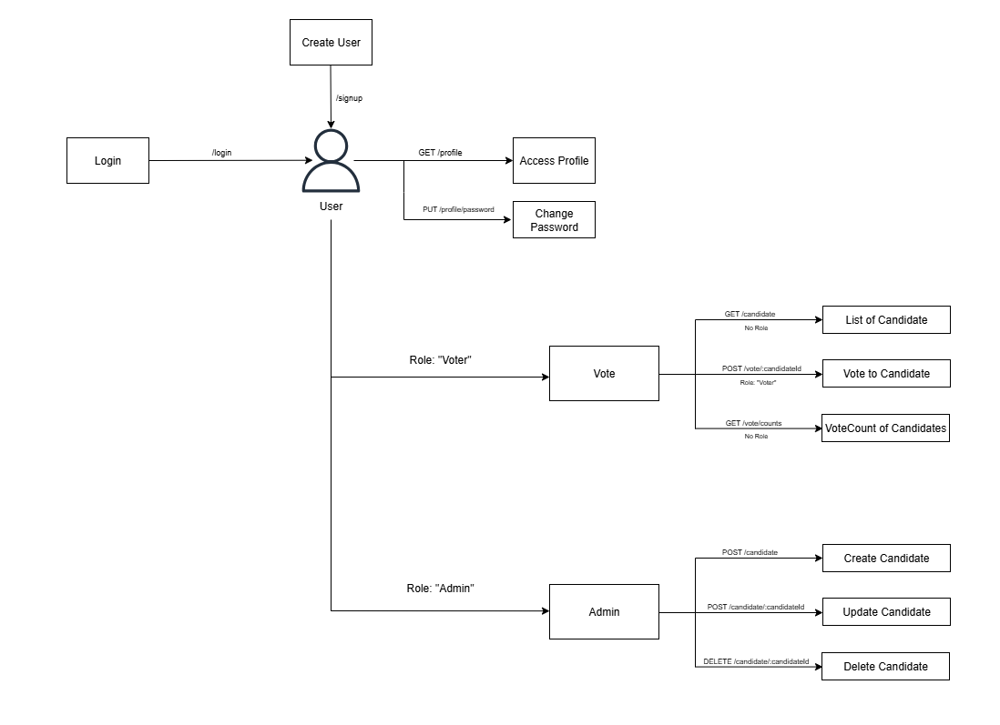

# 🗳️ Voting Application  

This is a **backend application** for a voting system where users can sign up, log in, and vote for candidates. It provides functionalities for **user authentication, candidate management, and voting**, with role-based access control for admins and voters.  

---

## 📌 Features  

- 👤 **User Management**
  - User signup and login with **National ID** and password  
  - Users can view the list of candidates  
  - Users can vote for a candidate (only once)  
  - Users can update their profile and change password  

- 🛠️ **Admin Management**  
  - Admin can add, update, or delete candidates  
  - Admin cannot vote  

- 📊 **Voting System**  
  - Voters can cast their vote only once  
  - Candidate vote counts are automatically updated  
  - Fetch vote results sorted by vote count  

---

## 🏗️ Architecture  





---

## ⚙️ Technologies Used  

- [Node.js](https://nodejs.org/)  
- [Express.js](https://expressjs.com/)  
- [MongoDB](https://www.mongodb.com/)  
- [Mongoose](https://mongoosejs.com/)  
- [JWT (JSON Web Tokens)](https://jwt.io/) for authentication  
- [bcrypt](https://www.npmjs.com/package/bcrypt) for password hashing  

---

## 🚀 Installation  

1. Clone the repository:  

   ```bash
   git clone https://github.com/alisameed32/voting_app.git
   cd voting_app
````

2. Install dependencies:

   ```bash
   npm install
   ```

3. Create a `.env` file in the root directory and configure your MongoDB connection:

   ```env
   PORT=3000
   localDBURL=mongodb://127.0.0.1:27017/voting_app
   JWT_SECRET=yourSecretKey
   ```

4. Start the server:

   ```bash
   npm start
   ```

   The server will run at:

   ```
   http://localhost:3000
   ```

---

````

## 📡 API Endpoints

### 🔐 Authentication

* **Sign Up** → `POST /user/signup`
* **Login** → `POST /user/login`

### 👤 User Profile

* **Get Profile** → `GET /user/profile` (Auth Required)
* **Change Password** → `PUT /user/profile/password` (Auth Required)

### 🗳️ Candidates

* **Get Candidates** → `GET /candidate`
* **Add Candidate (Admin only)** → `POST /candidate`
* **Update Candidate (Admin only)** → `PUT /candidate/:candidateId`
* **Delete Candidate (Admin only)** → `DELETE /candidate/:candidateId`

### 📊 Voting

* **Vote for Candidate (User only)** → `POST /candidate/vote/:candidateId`
* **Get Vote Count** → `GET /candidate/vote/counts`

---

## 📂 Project Structure

```
voting_app/
│-- db.js                # MongoDB connection
│-- server.js            # Entry point
│-- models/              # Mongoose models
│   │-- User.js
│   │-- Candidate.js
│-- routes/              # Express routes
│   │-- userRoutes.js
│   │-- candidateRoutes.js
│-- jwt.js               # JWT utilities
│-- .env                 # Environment variables
│-- .gitignore
│-- package.json
```

---


## ✅ Future Enhancements

* Add role-based middleware for better scalability
* Add refresh tokens for session management
* Implement rate limiting and request validation
* Build a frontend (React/Next.js) to connect with this backend


## 🧑‍💻 Author

👤 **Ali Sameed Arbani**

* 🌐 GitHub: [Ali Sameed](https://github.com/alisameed32)


